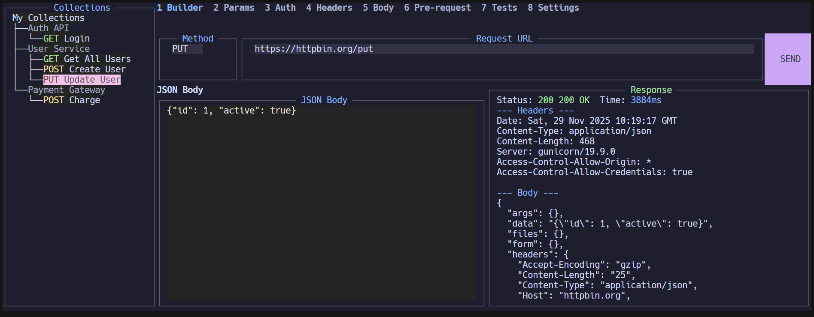

# Term REST Client

A beautiful, feature-rich terminal-based REST API client built with Go and [tview](https://github.com/rivo/tview). Test your APIs directly from the terminal with an intuitive, Postman-like interface.


## 📸 Screenshot



*Term REST Client in action: Building a PUT request, viewing collections, and displaying the response with headers and body.*

## ✨ Features

- 🎨 **Beautiful Terminal UI** - Modern, colorful interface built with tview
- 🎭 **Multiple Themes** - Switch between Catppuccin Mocha and Original themes
- 🖱️ **Mouse Support** - Click to focus and interact with UI elements
- 📁 **Request Collections** - Organize requests into collections
- 💾 **Save & Load** - Save requests to collections for quick access
- ✏️ **Edit & Delete** - Rename collections/requests or delete them
- 🚀 **Multiple HTTP Methods** - GET, POST, PUT, PATCH, DELETE
- 📝 **JSON Body Editor** - Built-in JSON body editor with syntax highlighting
- 📊 **Response Viewer** - View status, headers, and body with syntax highlighting
- ⚡ **Fast & Lightweight** - Pure Go, no dependencies on external services
- ⌨️ **Keyboard Shortcuts** - Full keyboard navigation support
- ⚙️ **Settings Tab** - Customize theme and view application information

## 🚀 Quick Start

### Prerequisites

- Go 1.24 or higher
- A terminal with 256-color support

### Installation

#### Windows

**Option 1: Using Build Script (Recommended)**
```cmd
# Clone the repository
git clone https://github.com/yourusername/term-rest-client.git
cd term-rest-client

# Build using batch script
build.bat

# Run the application
run.bat
```

**Option 2: Using PowerShell**
```powershell
# Clone the repository
git clone https://github.com/yourusername/term-rest-client.git
cd term-rest-client

# Build
.\build.ps1

# Run
.\bin\term-rest-client.exe
```

**Option 3: Using Go directly**
```cmd
# Clone the repository
git clone https://github.com/yourusername/term-rest-client.git
cd term-rest-client

# Build
go build -o bin\term-rest-client.exe cmd\term-rest-client\main.go

# Run
bin\term-rest-client.exe
```

**Option 4: Using Make (if you have Make installed)**
```cmd
# Install Make for Windows: https://www.gnu.org/software/make/
# Or use Chocolatey: choco install make

make build
make run
```

#### Linux / macOS

**Option 1: Using Build Script**
```bash
# Clone the repository
git clone https://github.com/yourusername/term-rest-client.git
cd term-rest-client

# Make script executable
chmod +x build.sh

# Build
./build.sh

# Run
./bin/term-rest-client
```

**Option 2: Using Make**
```bash
# Clone the repository
git clone https://github.com/yourusername/term-rest-client.git
cd term-rest-client

# Build
make build

# Run
make run
```

**Option 3: Using Go directly**
```bash
# Clone the repository
git clone https://github.com/yourusername/term-rest-client.git
cd term-rest-client

# Build
go build -o bin/term-rest-client cmd/term-rest-client/main.go

# Run
./bin/term-rest-client
```

### Using Go Install

```bash
go install github.com/yourusername/term-rest-client/cmd/term-rest-client@latest
```

### Cross-Platform Building

**Build for all platforms:**
```bash
# Linux/macOS
./build.sh all

# Windows PowerShell
.\build.ps1 all

# Using Make (all platforms)
make build-all
```

**Build for specific platform:**
```bash
# Windows
make build-windows

# Linux
make build-linux

# macOS
make build-darwin
```

## 📖 Usage

### Basic Operations

1. **Send a Request**
   - Enter URL in the URL field
   - Select HTTP method from dropdown
   - (Optional) Add JSON body
   - Press `Ctrl+Enter` or `Ctrl+S` or click `SEND` button

2. **Navigate Collections**
   - Use arrow keys or mouse to navigate the tree
   - Click on a request to load it into the builder

3. **Save a Request**
   - Build your request
   - Press `Ctrl+Shift+S` to save to current collection

4. **Edit Names**
   - Select a collection or request
   - Press `e` to edit its name

5. **Delete Items**
   - Select a collection or request
   - Press `Delete` or `d` to delete

6. **Create Collection**
   - Focus on the tree
   - Press `n` to create a new collection

7. **Change Theme**
   - Press `8` to open the Settings tab
   - Use the Theme dropdown to switch between available themes
   - Changes apply immediately

### Keyboard Shortcuts

#### Navigation & Focus
| Shortcut | Action | Context |
|----------|--------|---------|
| `Tab` | Move focus to next field | Anywhere |
| `Shift+Tab` | Move focus to previous field | Anywhere |
| `1-8` | Switch between tabs | Anywhere |
| Arrow Keys | Navigate tree/collections | Collections tree focused |
| `Enter` | Select/load request | Collections tree focused |

#### Request Operations
| Shortcut | Action | Context |
|----------|--------|---------|
| `Ctrl+Enter` | Send HTTP request | Builder tab |
| `Ctrl+S` | Send HTTP request | Builder tab |
| `Ctrl+Shift+S` | Save current request to collection | Builder tab |
| `Enter` | Send request (when URL field focused) | URL input field |

#### Collection & Request Management
| Shortcut | Action | Context |
|----------|--------|---------|
| `n` | Create new collection | Collections tree focused |
| `r` | Create new empty request | Collections tree focused |
| `e` | Edit selected item name | Collections tree focused (item selected) |
| `d` | Delete selected item | Collections tree focused (item selected) |
| `Delete` | Delete selected item | Collections tree focused (item selected) |

#### Application Control
| Shortcut | Action | Context |
|----------|--------|---------|
| `Esc` | Quit application | Anywhere |
| `Ctrl+Q` | Quit application | Anywhere |

### Command Rules

#### Creating Collections
- **Method 1**: Focus the Collections tree (left panel) and press `n`
  - A new collection named "New Collection" will be created
  - You'll be prompted to rename it immediately
  - Press `Enter` to confirm or `Esc` to cancel

- **Method 2**: When saving a request with `Ctrl+Shift+S`, if no collection exists, one will be created automatically

#### Creating Requests
- **Method 1**: Focus the Collections tree, select a collection (or leave root selected), and press `r`
  - Creates a new empty request with default GET method
  - Loads it into the builder automatically
  - You'll be prompted to rename it immediately

- **Method 2**: Build your request in the builder, then press `Ctrl+Shift+S`
  - Saves the current request to the selected collection
  - If no collection is selected, saves to the first available collection
  - If no collections exist, creates a new collection automatically

#### Editing Items
- Select any collection or request in the tree
- Press `e` to edit its name
- Enter the new name and press `Enter` to save, or `Esc` to cancel

#### Deleting Items
- Select any collection or request in the tree
- Press `d` or `Delete` key
- Confirm deletion in the modal dialog
- **Note**: Deleting a collection will delete all requests within it

#### Sending Requests
- **Method 1**: Fill in URL, select method, add body (optional), then press `Ctrl+Enter` or `Ctrl+S`
- **Method 2**: Fill in URL, select method, add body (optional), then click the `SEND` button
- **Method 3**: When URL field is focused, press `Enter` to send

#### Loading Saved Requests
- Navigate to a saved request in the Collections tree
- Press `Enter` or click on it
- The request will be loaded into the builder with its method, URL, and body

### Mouse Support

- Click on any UI element to focus it
- Click on tree nodes to select them
- Click `SEND` button to send request

## 🏗️ Project Structure

```
term-rest-client/
├── cmd/
│   └── term-rest-client/    # Main application entry point
├── internal/
│   ├── app/                 # Application logic
│   ├── models/              # Data models
│   └── ui/                  # UI components
├── pkg/
│   └── httpclient/         # HTTP client utilities
├── docs/                    # Documentation
│   ├── ARCHITECTURE.md      # Architecture overview
│   └── BUILD.md             # Detailed build instructions
├── build.bat                # Windows build script
├── build.ps1                # Windows PowerShell build script
├── build.sh                 # Linux/macOS build script
├── run.bat                  # Windows run script
├── run.sh                   # Linux/macOS run script
├── Makefile                 # Build automation (all platforms)
├── LICENSE                  # MIT License
├── CONTRIBUTING.md          # Contribution guidelines
├── CHANGELOG.md             # Version history
└── README.md                # This file
```

## 🛠️ Development

### Building from Source

**Windows:**
```cmd
# Install dependencies
go mod download

# Build
build.bat
# Or: make build

# Run tests
go test ./...
# Or: make test

# Format code
go fmt ./...
# Or: make fmt
```

**Linux/macOS:**
```bash
# Install dependencies
go mod download

# Build
./build.sh
# Or: make build

# Run tests
make test

# Format code
make fmt

# Lint code
make lint
```

For detailed build instructions, see [docs/BUILD.md](docs/BUILD.md).

### Running Tests

```bash
go test ./...
```

### Code Style

This project follows standard Go conventions. Please run `gofmt` and `golint` before submitting PRs.

## 🤝 Contributing

We welcome contributions! Please see [CONTRIBUTING.md](CONTRIBUTING.md) for details.

1. Fork the repository
2. Create your feature branch (`git checkout -b feature/amazing-feature`)
3. Commit your changes (`git commit -m 'Add some amazing feature'`)
4. Push to the branch (`git push origin feature/amazing-feature`)
5. Open a Pull Request

## 📝 Roadmap

- [ ] Request history
- [ ] Environment variables
- [ ] Authentication (Basic, Bearer, OAuth)
- [ ] Custom headers
- [ ] Query parameters editor
- [ ] Response formatting (JSON, XML, etc.)
- [ ] Export/Import collections
- [ ] Request/Response timings
- [ ] SSL certificate management
- [ ] Proxy support

## 🐛 Known Issues

- Some terminals may not support full mouse functionality
- Very long responses may cause performance issues

## 📄 License

This project is licensed under the MIT License - see the [LICENSE](LICENSE) file for details.

## 🙏 Acknowledgments

- [tview](https://github.com/rivo/tview) - Terminal UI library
- [tcell](https://github.com/gdamore/tcell) - Terminal cell library

## 📧 Contact

For questions, suggestions, or bug reports, please open an issue on GitHub.

---

Made with ❤️ using Go

