# Term REST Client

A terminal REST API client written in Go with [tview](https://github.com/rivo/tview). Build requests, organise them into collections, use variables, script simple pre-request steps and response tests, all without leaving the terminal. Saved requests can also be run from the command line, which makes them usable in CI.


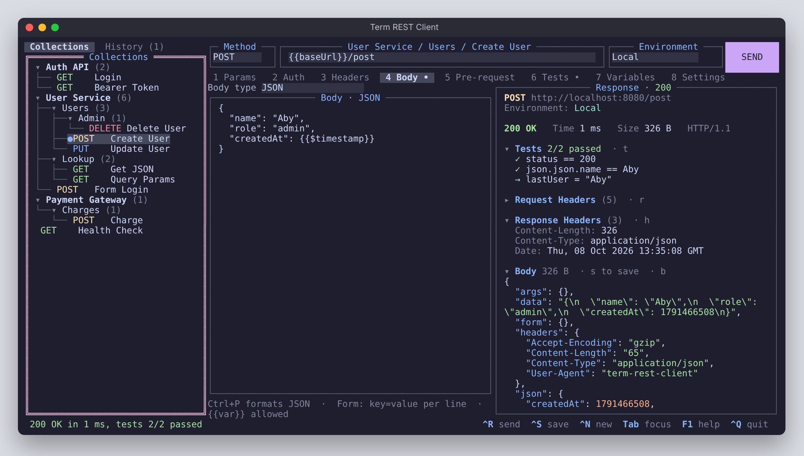

## Features

- **Request builder**: GET, POST, PUT, PATCH, DELETE, HEAD and OPTIONS, plus WebSocket, with a URL bar that autocompletes `{{variables}}`.
- **Params, Headers, Auth and Body tabs**: query parameters, headers, Basic / Bearer / API key auth, and JSON, text, XML, form-urlencoded or GraphQL bodies. Any line can be disabled by starting it with `#`.
- **GraphQL**: a Query editor and a Variables editor side by side, and a schema browser (`Ctrl+T`) that reads the server's schema and writes a query for any field.
- **Streaming responses**: Server-Sent Events and NDJSON show up live as they arrive, each event with its time. `Esc` stops a stream and keeps what came in; tests can count and inspect events.
- **WebSocket**: connect with your headers and auth, send messages, and watch a live log of what goes out and comes back. Tests run on the received messages when the connection ends.
- **Environments, like Postman**: named variable sets such as Local, Staging and Production. Pick one from the Environment selector next to the URL (or `Alt+E`); its values override Globals. Create, rename, duplicate and delete them in the Variables tab.
- **Variables**: `{{name}}` works in the URL, params, headers, auth fields and body. Built-ins: `{{$uuid}}`, `{{$timestamp}}`, `{{$isoTimestamp}}`, `{{$randomInt}}`.
- **Pre-request scripts**: `set name = value` / `unset name` before a request is sent.
- **Tests**: one assertion per line (`status == 200`, `json.items[0].id exists`, `time < 500` ...), plus `set token = json.token` to capture values for the next request.
- **Collections and folders, like Postman**: group requests into collections, folders inside collections, and folders inside folders to any depth. Requests can also live at the top level. Create, rename, duplicate, reorder, move and delete anything. Everything is saved to a JSON file automatically.
- **Unsaved changes are never lost**: edits you haven't saved are kept when you quit and restored on the next start. Opening another request asks before discarding.
- **Response viewer**: status, timing, size, the request headers that were actually sent, response headers, pretty-printed and colour-highlighted JSON, and test results. Each section folds open or closed with a key or a click, and the app remembers your choice. Press `s` to save the body to a file.
- **History, like Postman**: every request you send is listed in the sidebar's History view, grouped by day. Open one to see the request and the response it got, send it again, save it to a collection, filter, or delete. Kept in a separate file so your workspace file stays clean in git.
- **Import from cURL**: paste a curl command (from browser dev tools, API docs or Postman) into the URL field and it becomes a request, with headers, auth, body and params filled in.
- **Import from and export to Postman**: collections (v2.0/v2.1, with folders, auth, bodies and params), environments and globals. `Ctrl+O` imports and `x` exports in the app; `term-rest-client import` / `export` on the command line.
- **Code snippets, like Postman's `</>` panel**: `Ctrl+G` shows the current request as curl, Python (`requests`), JavaScript (`fetch`), Go (`net/http`) or HTTPie, and `c` copies it to the clipboard. `y` copies a request straight from the Collections tree or History. Variables can be filled in or kept as variables in the code.
- JSON formatter (`Ctrl+P`), request cancel (`Esc`).
- **Settings**: four themes (Catppuccin Mocha, Original, Gruvbox Dark, Light), timeout, redirect following, TLS verification.
- **Mouse support**: click any field or tab, scroll the response.
- **Headless mode**: `term-rest-client run "Collection/Folder/Request"` (or a whole folder) sends saved requests, prints results and exits non-zero when a test fails.

## Screenshots

| | |
|---|---|
| 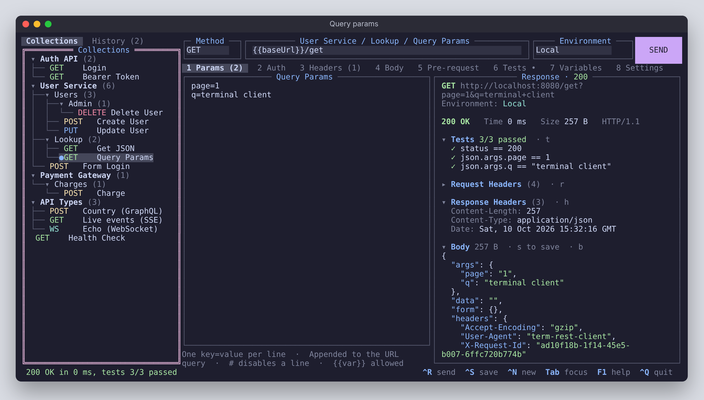 | 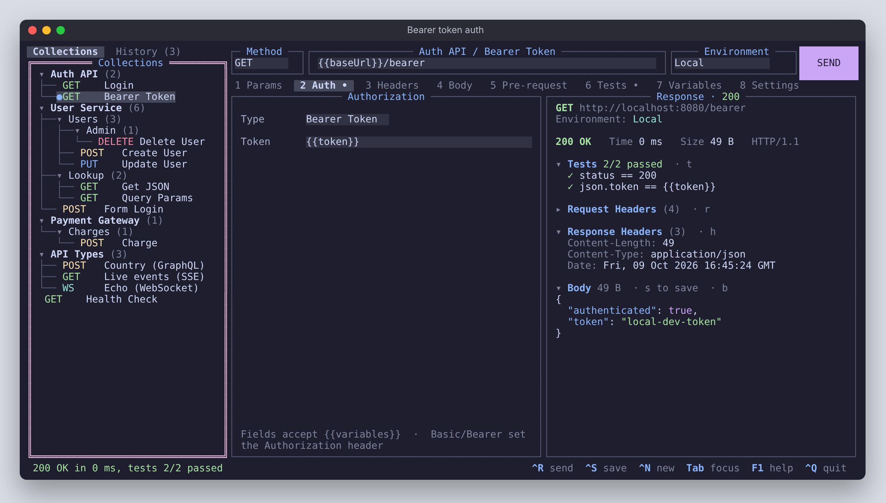 |
| **Query params and headers** with `{{variables}}` and a generated `{{$uuid}}` | **Auth tab**: Basic, Bearer or API key |
| 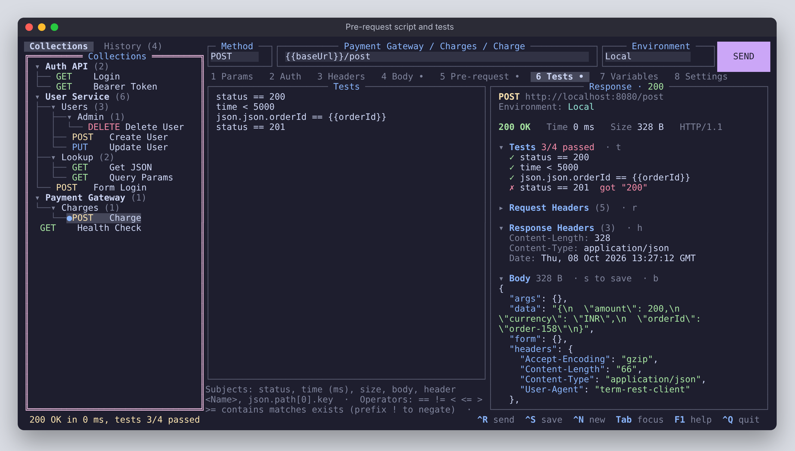 | 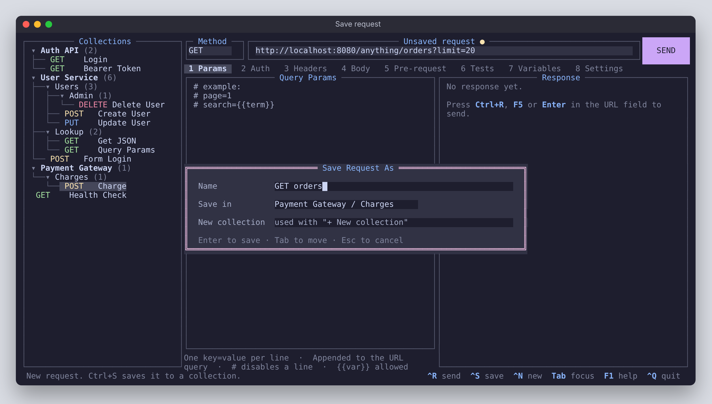 |
| **Tests**: each line passes or fails with the actual value | **Save as**: pick a name and collection |
| 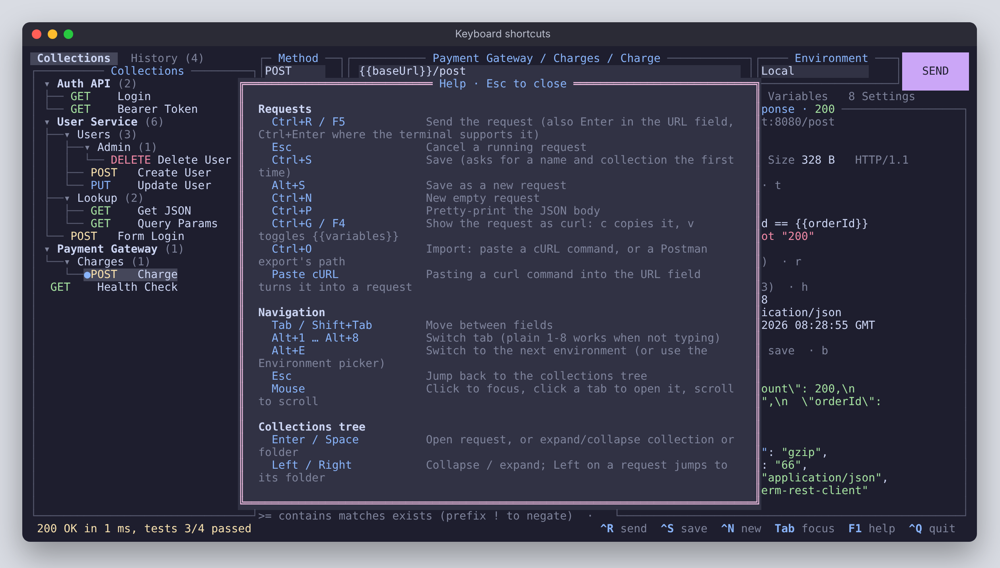 | 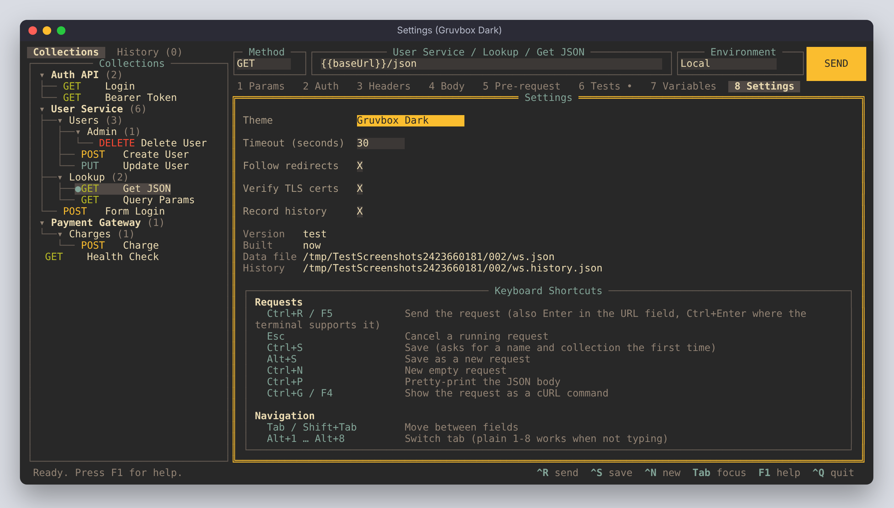 |
| **F1** shows every shortcut | **Settings** with the Gruvbox Dark theme |
| 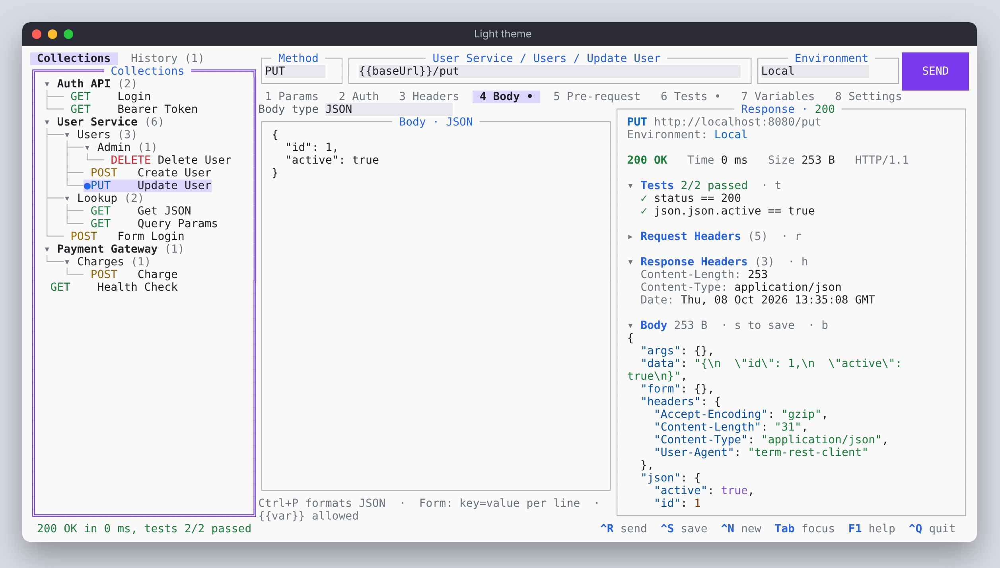 | 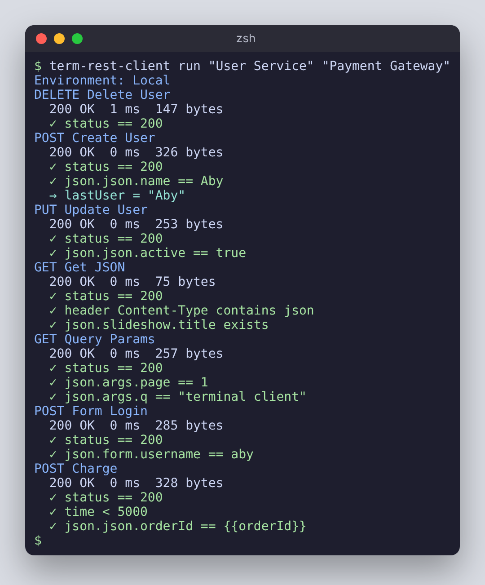 |
| **Light** theme | **`run` from the command line**, usable in CI |
| 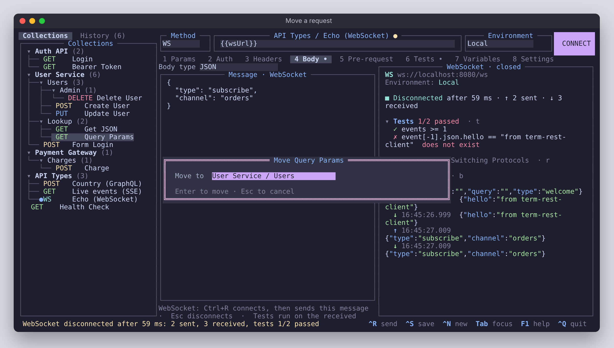 | 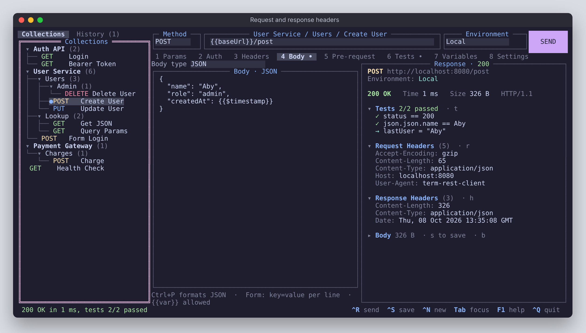 |
| **Folders**: nest them as deep as you like, and press `m` to move a request or folder | **Request and response headers**, each foldable (here the body is folded) |
| 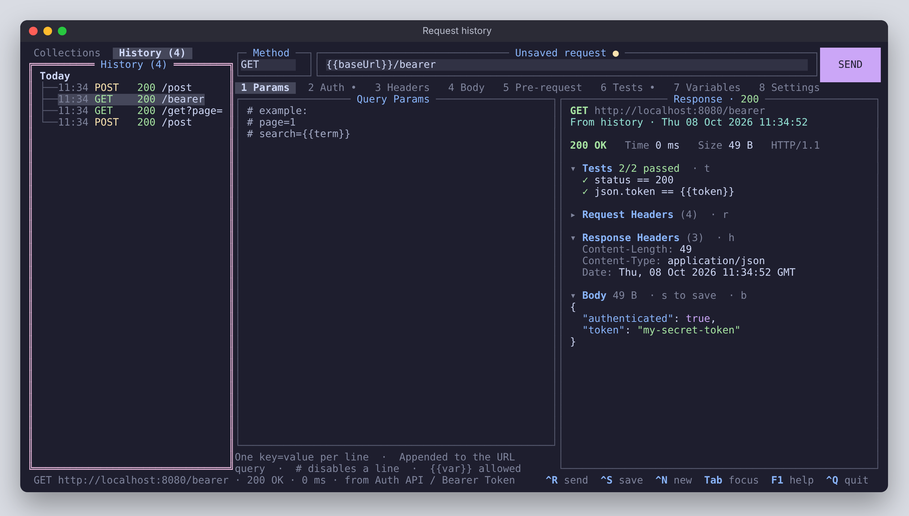 | 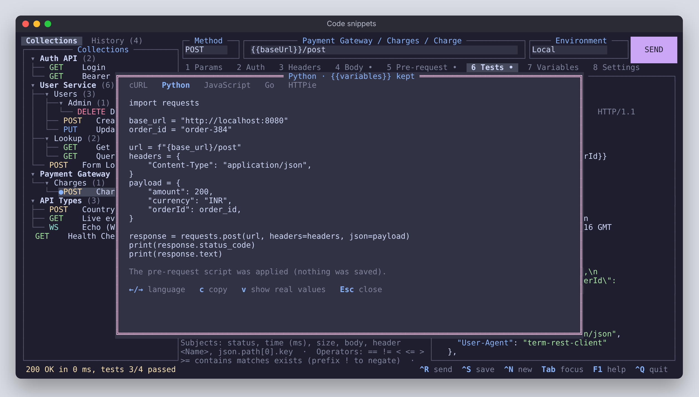 |
| **History**: every request you sent, grouped by day; the status bar shows the full URL | **`Ctrl+G`**: the request as cURL, Python, JavaScript, Go or HTTPie, ready to copy |
| 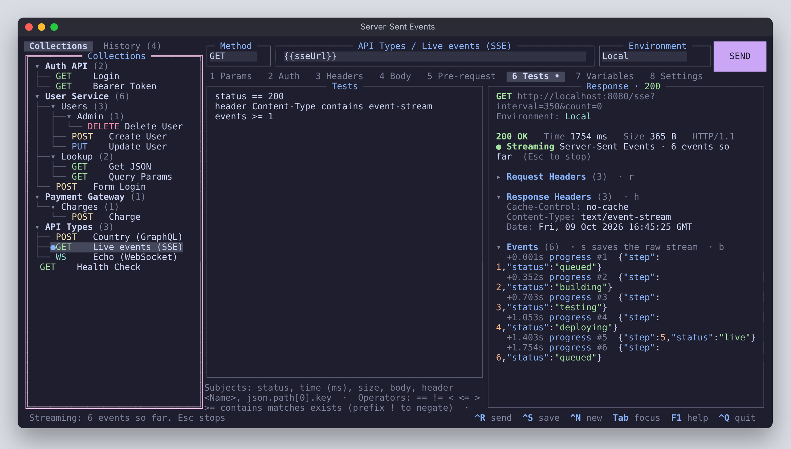 | 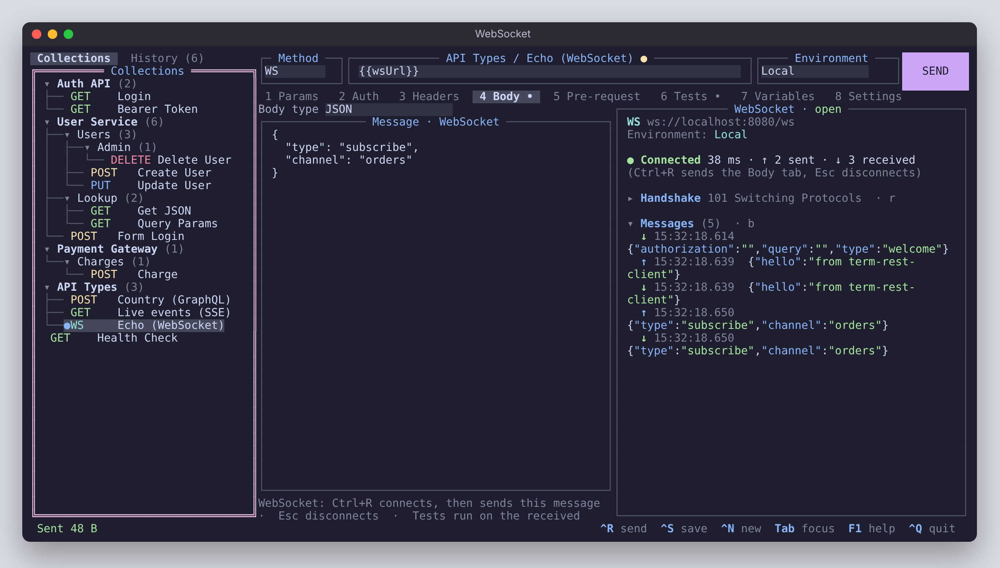 |
| **Streaming**: Server-Sent Events and NDJSON appear as they arrive | **WebSocket**: connect, send, and watch what comes back |
| 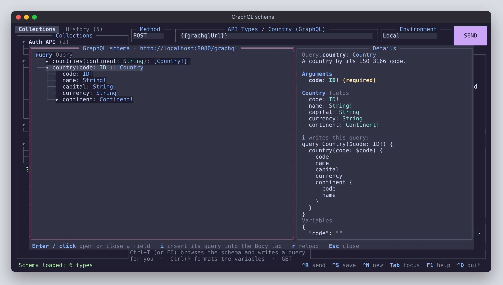 | 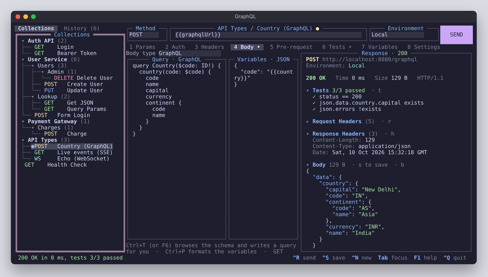 |
| **GraphQL schema** (`Ctrl+T`): browse the types, see a field's details, and `i` writes the query | **GraphQL**: query and variables side by side |

## Quick Start

### Download a prebuilt binary (no Go needed)

On macOS (Apple Silicon or Intel) or Linux (x86_64 or arm64):

```bash
curl -fsSL https://raw.githubusercontent.com/AbyAbyss/cli-rest-client/main/get.sh | sh
```

It downloads the right binary from the [latest release](https://github.com/AbyAbyss/cli-rest-client/releases/latest), checks it against the release's `SHA256SUMS`, and installs it to `/usr/local/bin`, `/opt/homebrew/bin` or `~/.local/bin` (whichever is writable first; `INSTALL_DIR=...` to choose). `VERSION=v0.2.0` installs a specific release. On Windows, download `term-rest-client-windows-amd64.zip` from the releases page and put `term-rest-client.exe` somewhere on your `PATH`.

If you download a macOS archive with a browser instead, macOS marks it as quarantined and refuses to open an unsigned binary. Clear the flag once with `xattr -d com.apple.quarantine term-rest-client`. Files fetched with `curl` (as above) aren't marked.

### Build from source

You need Go 1.24 or newer and a terminal with 256-colour (ideally true-colour) support.

#### macOS: install as a command you can run from any terminal

```bash
# 1. Install Go (skip if `go version` already works)
brew install go

# 2. Get the code
git clone https://github.com/AbyAbyss/cli-rest-client.git
cd cli-rest-client

# 3. Build the binary and put it on your PATH
make install            # same as ./install.sh
```

Then open any terminal window and run:

```bash
term-rest-client                          # launch the REST client
term-rest-client list                     # list saved requests
term-rest-client run "Auth API/Login"     # send a saved request without the UI
term-rest-client -version
```

`make install` picks the first of these it can write to: `/usr/local/bin`, `/opt/homebrew/bin` (Apple Silicon Homebrew), or `~/.local/bin`. If it ends up in a folder that isn't on your `PATH`, it prints the exact line to add to `~/.zshrc` (the default shell on macOS). For example:

```bash
echo 'export PATH="$HOME/.local/bin:$PATH"' >> ~/.zshrc
source ~/.zshrc
```

Other install commands:

| Command | What it does |
|---------|--------------|
| `make install` | Build with version info and install to your `PATH` |
| `INSTALL_DIR=/usr/local/bin make install` | Install to a specific folder (asks for your password if it needs `sudo`) |
| `make uninstall` | Remove the installed binary. Your collections are kept |
| `git pull && make install` | Update to the latest version |
| `make build` | Just build `./bin/term-rest-client` without installing |
| `make build-mac-universal` | One binary for both Intel and Apple Silicon Macs, in `dist/` |
| `make build-linux` | Linux binaries for amd64 and arm64, in `dist/` |

Want a shorter command? Add an alias to `~/.zshrc`:

```bash
echo "alias rest='term-rest-client'" >> ~/.zshrc && source ~/.zshrc
rest
```

#### Linux: install as a command you can run from any terminal

**1. Install the tools.** You need `git`, `make` and Go 1.21 or newer (Go downloads the 1.24 toolchain this project uses by itself). Distro Go packages are often older than that, so check with `go version` after installing.

| Distro | Command |
|--------|---------|
| Ubuntu / Debian | `sudo apt install git make` then `sudo snap install go --classic` |
| Fedora | `sudo dnf install git make golang` |
| Arch / Manjaro | `sudo pacman -S git make go` |
| openSUSE | `sudo zypper install git make go` |

No snap, or the packaged Go is too old? Use the official release (swap `amd64` for `arm64` on ARM machines such as a Raspberry Pi):

```bash
curl -LO https://go.dev/dl/go1.24.7.linux-amd64.tar.gz
sudo rm -rf /usr/local/go && sudo tar -C /usr/local -xzf go1.24.7.linux-amd64.tar.gz
echo 'export PATH="$PATH:/usr/local/go/bin"' >> ~/.bashrc && source ~/.bashrc
go version
```

**2. Build and install.**

```bash
git clone https://github.com/AbyAbyss/cli-rest-client.git
cd cli-rest-client
make install            # same as ./install.sh
```

On most Linux systems `/usr/local/bin` needs root, so the binary goes to `~/.local/bin` without asking for a password. Ubuntu, Debian and Fedora already put `~/.local/bin` on your `PATH` (you may need to open a new terminal, or log out and back in, the first time it's created). If it isn't on your `PATH`, the installer prints the line for your shell: `~/.bashrc` for bash, `~/.zshrc` for zsh, or `fish_add_path` for fish. For example:

```bash
echo 'export PATH="$HOME/.local/bin:$PATH"' >> ~/.bashrc
source ~/.bashrc
```

To install system-wide for all users instead (asks for your password once, for the copy):

```bash
INSTALL_DIR=/usr/local/bin make install
```

**3. Run it** from any terminal: `term-rest-client`. `make uninstall`, `git pull && make install` and the `rest` alias work exactly as on macOS (put the alias in `~/.bashrc` instead of `~/.zshrc` if you use bash).

**Servers without Go.** Build on any machine and copy the binary over. It's a single static file with no dependencies:

```bash
make build-linux        # dist/term-rest-client-linux-amd64 and -linux-arm64
scp dist/term-rest-client-linux-amd64 user@server:~/.local/bin/term-rest-client
```

Over SSH the UI works in any terminal; `term-rest-client run ...` is handy for scripted checks on servers.

#### Windows

```cmd
build.bat
bin\term-rest-client.exe
```

See [docs/WINDOWS.md](docs/WINDOWS.md) for PowerShell and other options.

#### With `go install`

```bash
go install github.com/AbyAbyss/cli-rest-client/cmd/term-rest-client@latest
```

This puts the binary in `$(go env GOPATH)/bin` (usually `~/go/bin`), which needs to be on your `PATH`.

### Try it with the samples

A new workspace file starts with sample collections: a user service, auth, payments, and GraphQL, SSE and WebSocket examples. `term-rest-client demo` runs a small local server that answers all of them, so you can try everything offline without touching your own workspace:

```bash
term-rest-client demo                    # leave this running (Ctrl+C stops it)

# in another terminal
term-rest-client -data demo.json         # the app, with its own sample workspace
term-rest-client -data demo.json run -env Local "Auth API" "User Service/Lookup" "Payment Gateway"
```

The sample's **Local** environment points at the demo server (`localhost:8080`); **httpbin.org** uses the public httpbin.org instead. `-addr localhost:9090` runs the demo on another port.

### First run

On first start the workspace contains sample collections that call [httpbin.org](https://httpbin.org). Open one, press `Ctrl+R`, and you'll see the response and test results.

See [QUICKSTART.md](QUICKSTART.md) and [docs/BUILD.md](docs/BUILD.md) for more build options.

## Using the app

The screen has four areas: the **Collections tree** on the left, the **request bar** (method, URL, SEND) at the top, the **request tabs** below it, and the **Response** pane on the right.

| Tab | What it holds |
|-----|---------------|
| 1 Params | Query parameters, `key=value` per line. They are appended to whatever query string the URL already has. |
| 2 Auth | No Auth, Basic Auth, Bearer Token, or API Key (sent as a header or a query parameter). |
| 3 Headers | `Name: value` per line. |
| 4 Body | Body type (None, JSON, Text, XML, Form) and the body text. `Content-Type` is set from the type unless you set it in Headers. Form bodies are `key=value` per line. |
| 5 Pre-request | Script run before sending (see below). |
| 6 Tests | Assertions run on the response (see below). |
| 7 Variables | Globals and environments, `name=value` per line. Create, rename, duplicate, delete and activate environments here |
| 8 Settings | Theme, timeout, redirects, TLS verification, version, data file location and the keyboard reference. |

Tabs that contain something show a marker, for example `Headers (2)` or `Tests •`. A `●` next to the request title means it has unsaved changes.

### Keyboard shortcuts

| Keys | Action |
|------|--------|
| `Ctrl+R`, `F5`, `Enter` in the URL field | Send the request (`Ctrl+Enter` also works in terminals that report it) |
| `Esc` | Cancel a running request, stop a stream, or close a WebSocket; otherwise jump to the Collections tree |
| `Ctrl+S` | Save. The first save of a new request asks for a name and collection |
| `Alt+S` | Save as a new request |
| `Ctrl+N` | New empty request |
| `Ctrl+P` | Pretty-print the JSON body (the variables, for GraphQL) |
| `Ctrl+T`, `F6` | GraphQL: browse the schema (types) of the URL and write a query for a field |
| `Ctrl+G`, `F4` | Show the request as code. In that window `←`/`→` switch language, `c` copies, `v` switches between real values and `{{variables}}` |
| `Ctrl+O` | Import: paste cURL command(s), or give the path of a Postman export |
| `Tab` / `Shift+Tab` | Move between fields |
| `Alt+1` ... `Alt+8` | Switch tab. Plain `1`-`8` also works when you're not typing in a text field |
| `Alt+E` | Switch to the next environment (No Environment → each environment → back) |
| `F1`, `?` | Help |
| `Ctrl+Q`, `Ctrl+C` | Quit |

**On a Mac:** the top-row keys are media keys by default (F6 turns on Do Not Disturb, F3 opens Mission Control), so `F1`-`F6` only reach the app with `fn` held down, or after turning on *System Settings → Keyboard → Keyboard Shortcuts → Function Keys → Use F1, F2, etc. keys as standard function keys*. Every F-key action also has another key: `?` for help, `e` to rename, `Ctrl+G` for code, `Ctrl+R` to send, `Ctrl+T` for the GraphQL schema. The `Alt` shortcuts (`Alt+S` save as, `Alt+E` next environment, `Alt+H` / `Alt+C` history and collections) need the Option key to act as Alt: in Terminal.app turn on *Settings → Profiles → Keyboard → Use Option as Meta key*; in iTerm2 set *Settings → Profiles → Keys → Left Option key* to *Esc+*. Without that, click the environment picker and the sidebar tabs instead.

In the **Collections tree**:

| Keys | Action |
|------|--------|
| `Enter`, `Space` | Open a request, or expand / collapse a collection or folder |
| `Left` / `Right` | Collapse / expand. `Left` on a request jumps to its folder |
| `n` | New collection (top level) |
| `f` | New folder inside the selected collection or folder (or the folder of the selected request) |
| `a` (or `r`) | New request in the selected collection or folder. With nothing selected it goes to the top level |
| `m` | Move the selected request or folder to another collection, folder, or the top level |
| `i` | Import cURL or a Postman file (same as `Ctrl+O`) |
| `x` | Export the selected collection or folder as a Postman collection |
| `y` | Copy the selected request to the clipboard as code (curl until you pick another language in `Ctrl+G`) |
| `e` (or `F2`) | Rename |
| `c` | Duplicate. Folders are copied with everything inside |
| `d` (or `Delete`) | Delete, after confirmation. Deleting a collection or folder deletes everything inside it |
| `Shift+Up` / `Shift+Down`, `K` / `J` | Move up / down within the same folder |

### Organising requests

The tree works like Postman's sidebar:

```
▾ User Service             collection
  ▾ Users                  folder
    ▾ Admin                folder inside a folder
        DELETE Delete User
      POST   Create User
      PUT    Update User
  ▾ Lookup
      GET    Get JSON
    POST   Form Login      request directly in the collection
▾ Payment Gateway
  ▾ Charges
      POST   Charge
  GET    Health Check      top-level request, not in any collection
```

- Inside each collection or folder, sub-folders are listed first, then requests.
- The request title above the URL shows the full path, for example `User Service / Users / Create User`, so you always know which API you're editing.
- Counts next to a collection or folder include everything in its sub-folders.
- **Save As** (`Alt+S`, or `Ctrl+S` on a new request) lets you pick any collection or folder, the top level, or a new collection.
- A folder moved to the top level with `m` becomes a collection, and a collection moved into another one becomes a folder.

In the **Response** pane: arrow keys, `PgUp`/`PgDn` and `g`/`G` scroll, `s` saves the body to a file.

### Importing from cURL

Copy a request as cURL (Chrome or Firefox dev tools: right-click a request → **Copy as cURL**; or any `curl` example from API docs) and:

- **paste it into the URL field**: it turns into a request straight away (method, URL, query params, headers, auth, body), unsaved, ready to send with `Ctrl+R` or save with `Ctrl+S`. Typing `curl ...` in the URL field and pressing `Enter` does the same;
- or press `Ctrl+O` and paste one or more commands. Several commands become a new collection called "cURL import";
- or from a terminal: `term-rest-client curl -into "Shop API/Orders" -X POST https://api.example.com/orders -d '{"qty":1}'`, `pbpaste | term-rest-client curl` (reads standard input), or `term-rest-client import calls.sh` for a file of curl commands.

Understood:

| curl | Becomes |
|------|---------|
| URL (`--url` or positional), `?query` | URL and Params |
| `-X`, `-I` (HEAD), `-G` (data as query) | Method; POST when there is a body |
| `-H 'Name: value'`, `-A`, `-e`, `-b 'a=1; b=2'` | Headers (User-Agent, Referer, Cookie) |
| `-u user:pass`, `--oauth2-bearer`, `Authorization: Bearer/Basic` header | The Auth tab (Basic or Bearer) |
| `-d`, `--data-raw`, `--data-binary`, `--data-urlencode`, `--json` | Body: JSON when the Content-Type (or the body) says so, form fields for `key=value&...`, XML or text otherwise |
| `-F name=value` | Form fields (file fields are skipped) |
| `$'...'`, `'...'`, `"..."`, `\` line breaks, `;`, `&&`, `\| jq` | Shell quoting and line continuations as bash reads them; pipes are ignored |
| `-L`, `-s`, `-v`, `--compressed`, `-o`, `-m`, ... | Ignored (they don't change the request) |

`-k`, bodies read from `@file`, and file uploads can't be carried over and are listed in a notes window.

### Code snippets and copying as cURL

`Ctrl+G` (or `F4`) opens the current request as code, ready to paste into a terminal, a script, a bug report or a chat. In that window:

- `←` / `→` (or `1`-`5`) switch between **cURL**, **Python** (`requests`), **JavaScript** (`fetch`), **Go** (`net/http`) and **HTTPie**. The app remembers the language you picked;
- `c` copies the code to the clipboard and closes the window;
- `v` switches between **real values** (variables filled in from the active environment, auth and params applied, the pre-request script run on a scratch copy so nothing is saved) and **`{{variables}} kept`**, which is handy for docs or for sharing with someone who has their own environment;
- `Esc` closes it.

The Charge sample request as Python, with real values:

```python
import requests

url = "https://httpbin.org/post"
headers = {
    "Content-Type": "application/json",
}
payload = {
    "amount": 200,
    "currency": "INR",
    "orderId": "order-831",
}

response = requests.post(url, headers=headers, json=payload)
print(response.status_code)
print(response.text)
```

How each language handles the details:

| | Python | JavaScript | Go | HTTPie |
|---|---|---|---|---|
| JSON body | a dict, sent with `json=` | an object in `JSON.stringify(...)` | the body text as you wrote it | `key=value` and `key:=json` items (`--raw` for arrays) |
| Form body | a dict (list of pairs if a key repeats) in `data=` | `URLSearchParams` | `url.Values` | `--form` items |
| Params tab | `params=` | `url.searchParams` | appended to the URL, `url.QueryEscape` for variables | `name==value` items |
| Basic auth | `auth=(user, pass)` | `btoa` in an `Authorization` header | `req.SetBasicAuth` | `-a user:pass` |

With `{{variables}} kept`, each variable becomes a named variable at the top of the snippet, set to its current value (`base_url = "https://httpbin.org"` in Python, `const baseUrl` in JavaScript, `baseUrl :=` in Go, `BASE_URL=` for HTTPie), so the code still runs. A variable used as a whole JSON value, like `"createdAt": {{$timestamp}}`, keeps its type. JavaScript snippets use top-level `await`: run them in a browser console, as an ES module (`node file.mjs`), or wrap them in an async function. `fetch` can't send a body with GET or HEAD, so that snippet leaves it out with a comment. Pre-request and test scripts stay in the app, as in Postman.

Every snippet is checked in the test suite by running it (Python, Node, Go and HTTPie) against a local server and comparing what arrives with what the app itself sends.

`y` on a request in the Collections tree, or on an entry in History, copies it with real values without opening anything, in the language you last picked (curl at first). If a variable isn't defined the status bar says which one, and it stays as `{{name}}`.

The clipboard is reached through `pbcopy` on macOS, `wl-copy`, `xclip` or `xsel` on Linux (whichever is installed), and `clip` on Windows or WSL. Over SSH, or when none of those exist, the app sends the text to your terminal with the OSC 52 escape sequence, which iTerm2, kitty, WezTerm, Alacritty, Windows Terminal and tmux (with `set -g set-clipboard on`) understand. macOS Terminal.app doesn't support OSC 52, so over SSH from Terminal.app open the window with `Ctrl+G` and select the text instead.

From a terminal: `term-rest-client export -lang python "Payment Gateway/Charges/Charge"` prints the code (`-lang` takes `curl`, `python`, `javascript`, `go` or `httpie`; `-curl` is short for `-lang curl`). `-raw` keeps `{{variables}}`, and a collection or folder name prints every request inside it. Pipe it to `pbcopy` to copy it.

### Streaming responses (Server-Sent Events, NDJSON)

A response with `Content-Type: text/event-stream` (Server-Sent Events) or an NDJSON type (`application/x-ndjson`, `application/jsonl`, ...) is shown as it arrives. The pane says **● Streaming**, counts the events, and lists each one with the time it arrived after the request started, its event type and id, and its data (JSON is highlighted):

```
● Streaming Server-Sent Events · 3 events so far  (Esc to stop)

▾ Events (3)  · s saves the raw stream
  +0.012s progress #1  {"step":1,"status":"queued"}
  +0.214s progress #2  {"step":2,"status":"building"}
  +0.415s progress #3  {"step":3,"status":"testing"}
```

- The request timeout only covers the wait for the response headers, so a stream can run as long as the server keeps it open.
- `Esc` stops the stream. Everything that arrived is kept, the tests run on it, and it goes into History like any response.
- Tests can use `events` and `event[i]` (see [Tests](#tests)).
- On the command line, `run` follows a stream until it ends or `-stream` runs out (the timeout setting by default), then stops it and runs the tests: `term-rest-client run -stream 10s "API Types/Live events (SSE)"`.

The sample **API Types / Live events (SSE)** request follows Wikimedia's public stream of edits to Wikipedia, which never ends, so press `Esc` when you've seen enough.

### GraphQL

Choose **GraphQL** as the body type. The Body tab splits into a **Query** editor and a **Variables** editor (a JSON object), and the request is sent as `{"query": ..., "variables": ...}` with `Content-Type: application/json`. A GET request sends both in the URL instead, as GraphQL over HTTP describes. `{{variables}}` work in both editors.

Press `Ctrl+T` (or `F6`) to browse the server's schema. The app sends an introspection query to the URL, with the request's headers and auth, and lists the query, mutation and subscription fields with their arguments and types:

- **`Enter`, `Space` or a click** opens or closes a field to show its type's fields, so you can walk the whole schema (`→` / `←` work too).
- **The Details pane** shows the selected field's description, its arguments (required ones marked), the fields of the type it returns, and the query `i` would write.
- **`i`** writes that query into the Body tab and closes the browser. On a nested field it writes the query for the top-level field it's under, with a variable for each argument and the result's fields already selected:

```graphql
query Country($code: ID!) {
  country(code: $code) {
    code
    name
    capital
    currency
    continent {
      code
      name
    }
  }
}
```

Fill in the variables and send. `r` in the browser reloads the schema, `Esc` closes it. Postman collections with GraphQL bodies import and export as GraphQL, and pasting a curl command whose body is a GraphQL query turns it into one. Try the sample **API Types / Country (GraphQL)**, which uses the public countries API.

### WebSocket

Pick **WS** in the method dropdown and enter a `ws://` or `wss://` URL (`http(s)://` works too). Params, Headers and Auth go into the handshake, and the Body tab becomes the message to send.

- `Ctrl+R` (or the **CONNECT** button) connects. After that, `Ctrl+R` (**SEND**) sends the Body tab as a text message, with `{{variables}}` filled in. Edit and send as often as you like.
- The response pane is a live log: `↑` for sent and `↓` for received messages, each with its time, plus the handshake's request and response headers.
- `Esc` disconnects. When the connection ends, whether you closed it or the server did, the tests run on the received messages: `events`, `event[i]`, and `body` (the last message).
- On the command line, `run` connects, sends the message, and collects replies until the server closes, `-stream` runs out, or a second passes with nothing new. Then it runs the tests, so WebSocket checks fit in CI.
- `Ctrl+G` shows WebSocket requests as JavaScript (`WebSocket`, Node 22 or a browser), Python (`websockets`), Go (`coder/websocket`), or a `websocat` command in the cURL tab.

Postman keeps WebSocket requests outside its collection format, so exporting a folder to Postman leaves them out and says so. The sample **API Types / Echo (WebSocket)** talks to Postman's public echo server.

### Importing from Postman

In Postman, export what you need (**Export** on a collection, choose **Collection v2.1**; environments and globals export from their own menus), then:

- in the app press `Ctrl+O` (or `i` in the Collections tree) and enter the file path, or
- from a terminal: `term-rest-client import ~/Downloads/Shop.postman_collection.json ~/Downloads/Staging.postman_environment.json`

The file type is detected automatically.

| Postman | Becomes |
|---------|---------|
| Collection, folders, nested folders | A collection with the same folders |
| Request method, URL, headers (disabled ones stay disabled) | The same, with query parameters moved to the Params tab |
| Path variables like `/users/:id` | The value Postman had, or `{{id}}` if it was empty |
| Auth: Bearer, Basic, API key, No auth | The same. Auth set on the collection or a folder is copied to every request that inherits it |
| Body: raw JSON / XML / text, x-www-form-urlencoded | The same body type |
| Body: GraphQL | A JSON body with `query` and `variables` |
| Body: form-data | Form fields, sent urlencoded. File fields are skipped |
| Collection variables | Added to Globals (existing globals keep their value) |
| Environment export | A new environment (not activated) |
| Globals export | Added to Globals (existing ones keep their value) |
| `{{$guid}}`, `{{$randomUUID}}` | `{{$uuid}}` |
| Scripts | Common patterns are converted: `pm.response.to.have.status(200)` → `status == 200`, response time checks, header checks, `pm.environment.set("x", jsonData.a.b)` → `set x = json.a.b`, and literal `set`s in pre-request scripts. The original JavaScript is kept below as comments |

Anything that doesn't carry over (OAuth 2 and other auth types, file uploads, collection-level scripts) is listed in a notes window after the import, so you know what to check. Importing the same collection twice creates "Shop API 2" rather than overwriting.

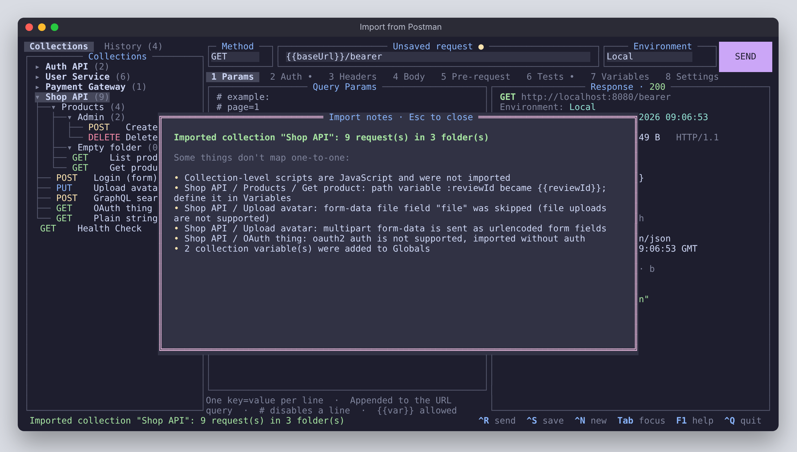

### Exporting to Postman

- **A collection or folder**: select it (or any request inside it) in the Collections tree and press `x`. The file is a Postman **Collection v2.1** you can import in Postman with **Import**. Top-level requests export together as a collection called "Requests".
- **An environment or the globals**: in tab **7 Variables**, pick it in **Editing** and press **Export**.
- From a terminal:

```bash
term-rest-client export -o Users.postman_collection.json "User Service/Users"
term-rest-client export -env Local -o Local.postman_environment.json
term-rest-client export -globals > globals.postman_globals.json
```

The app suggests a file name in the folder you last imported from or exported to, and asks before replacing an existing file.

What goes into the file:

- Folders, requests, method, URL, query params and headers (disabled ones stay disabled in Postman).
- Auth on every request (Bearer, Basic, API key, or No Auth), so nothing depends on Postman's inheritance.
- Bodies: JSON, XML and text as raw bodies with the right language; form bodies as x-www-form-urlencoded.
- `{{$uuid}}` becomes Postman's `{{$randomUUID}}`.
- **Scripts:** a request that came from Postman gets its original JavaScript back exactly. Scripts written here are translated line by line into Postman JavaScript, for example `status == 200` → `pm.test("status == 200", function () { pm.response.to.have.status(200); });` and `set token = json.token` → `pm.environment.set("token", pm.response.json().token);`. Comparisons follow this app's rules (`json.page == 1` also passes when the value is the string `"1"`). A line with no Postman equivalent is kept as a comment and listed in an export notes window.

Exporting and importing again gives back the same requests; the test suite checks this round trip, and checks that the generated Postman tests pass or fail exactly like the originals.

### History

Every request you send is recorded, like Postman's History tab. Switch the sidebar with `Alt+H` (History) and `Alt+C` (Collections), `F3` to flip between them, or click the tabs above the sidebar.

```
 Collections   History (3)
 ▾ Today
   11:42 POST   201 /users
   11:40 GET    200 /users?page=2
   11:38 GET    ERR /health
 ▾ Yesterday
   17:05 DELETE 204 /users/7
```

| Keys | Action |
|------|--------|
| Arrows | Move through entries. The status bar shows the full URL, status, time and the saved request it came from |
| `Enter` | Open it: the request goes into the builder as an unsaved copy and the response pane shows the response it got then, marked "From history" |
| `s` | Save the entry to a collection or folder |
| `y` | Copy the entry's request as code (same language as `Ctrl+G`) |
| `/` | Filter by text in the URL, method, status or request name. `c` clears the filter |
| `d` (or `Delete`) | Delete the entry |
| `X` | Clear all history, after confirmation |

Each entry keeps the request as you wrote it (with `{{variables}}`, so sending it again uses current values), the resolved URL and headers that were sent, the status, timing, response headers, test results, and up to 64 KB of the response body. Failed requests (connection refused, timeouts) are recorded too. The newest 200 entries are kept.

History is stored next to the workspace file as `<name>.history.json` (for example `workspace.history.json`), so committing a workspace file doesn't pick up your request log. Turn recording off with **Record history** in Settings. `term-rest-client history` prints recent entries from the command line.

### Response sections

The response pane is split into sections that you can fold open (`▾`) or closed (`▸`):

| Section | Key | Shows |
|---------|-----|-------|
| Tests | `t` | Each test line passed or failed, plus captured values |
| Request Headers | `r` | Every header that was sent, including the ones added for you: `Authorization` from the Auth tab, `Content-Type` from the body type, `User-Agent`, `Host`, `Content-Length` and `Accept-Encoding` |
| Response Headers | `h` | The headers the server returned, sorted by name |
| Body | `b` | The body, pretty-printed and highlighted when it's JSON |

Press the key while the response pane has focus, or click the section heading. Request Headers starts folded so the response stays readable; whatever you choose is remembered between runs. The status line (code, time, size) always stays visible.

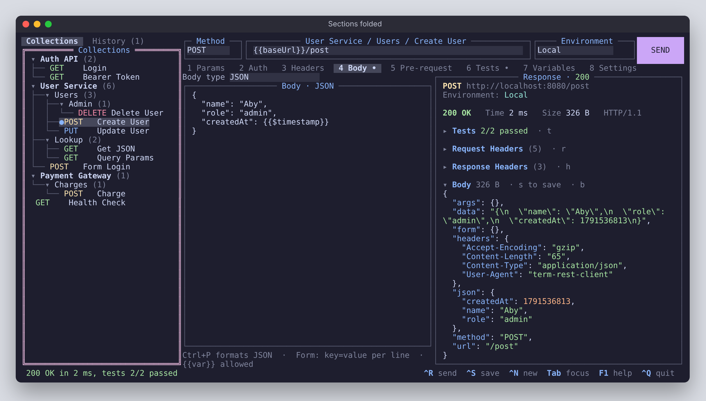

In dialogs: `Enter` confirms, `Tab` moves between fields, `Esc` cancels.

### Environments and variables

Variables work like Postman's:

- **Globals** are available in every request.
- **Environments** are named sets (Local, Staging, Production, ...). One can be active at a time, and its values override Globals with the same name. Pick it in the **Environment** selector next to the URL, or press `Alt+E` to step through them. "No Environment" uses Globals only.

Use any variable as `{{name}}` in the URL, params, headers, auth fields or body.

Manage them in tab **7 Variables**:

| Control | What it does |
|---------|--------------|
| **Editing** dropdown | Choose what the text box edits: Globals or one of the environments (the active one is marked) |
| Text box | `name=value` per line; `#` disables a line |
| **New** | Create an environment |
| **Rename** / **Duplicate** / **Delete** | Act on the environment being edited. Deleting the active one switches to No Environment |
| **Use it** | Make the environment being edited the active one |
| **Export** | Save the environment (or Globals) as a Postman file |

The sample workspace has a global `token` and two environments: **httpbin.org** (`baseUrl=https://httpbin.org`) and **Local** (`baseUrl=http://localhost:8080` and its own `token`). Switching between them sends the same requests to a different server.

The response pane shows which environment a request used, and History remembers it. If a `{{variable}}` can't be resolved it is left as-is and a warning says where the app looked (for example "not set in Local or Globals").

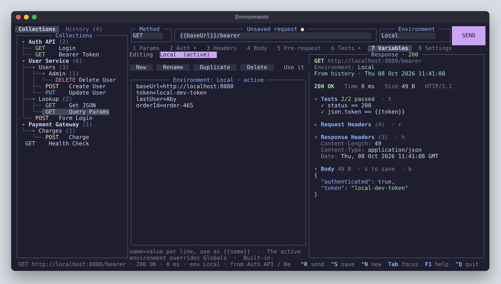

### Pre-request scripts

```
# lines starting with # are comments
set orderId = order-{{$randomInt}}
set auth = Bearer {{token}}
unset oldValue
```

`set` updates the variable where it already lives (the active environment first, then Globals). A new variable goes into the active environment, or into Globals when no environment is active. Changes show up in the Variables tab and stay available for later requests.

### Tests

One assertion per line. Each line is reported as passed (`✓`) or failed (`✗`) with the actual value.

```
status == 200
status < 300
time < 1000                       # milliseconds
size > 0                          # body size in bytes
header Content-Type contains json
header X-Rate-Limit exists
body contains "hello"
json.data.items[0].id == 42
json.data.items.length == 3
json.user.name matches ^Ab
json.error !exists
set token = json.token            # capture a value into a variable
```

For streams and WebSockets there are two more subjects: `events` is the number of events (or received messages), and `event[i]` is one of them, counting from 0, with `event[-1]` the last. Add `.json.path` to look inside a JSON event:

```
events >= 3
event[0].json.status == queued
event[-1].json.done == true
event[1] contains "tick"
```

Subjects: `status`, `time`, `size`, `body`, `header <Name>`, `json.<path>`, `events`, `event[i]`. Operators: `==`, `!=`, `<`, `<=`, `>`, `>=`, `contains`, `matches` (regular expression), `exists`, and the negations `!contains`, `!matches`, `!exists`. Numbers compare numerically (`1.50 == 1.5`), everything else as text. The expected value may use `{{variables}}`.

## Command-line mode

```bash
term-rest-client list                                   # list saved requests
term-rest-client run "User Service/Lookup/Get JSON"     # one request, by its full path
term-rest-client run "User Service/Users"               # everything in a folder, sub-folders included
term-rest-client run "Auth API" "Payment Gateway"       # whole collections, in order
term-rest-client run "Health Check"                     # a top-level request
term-rest-client run -env Local "User Service"          # use a different environment for this run
term-rest-client env                                    # list environments (* marks the active one)
term-rest-client env Staging                            # switch the active environment ("none" or "global" for Globals only)
term-rest-client demo                                   # local demo server for the sample workspace's Local environment
term-rest-client history -n 10                          # the last 10 requests sent from the app
term-rest-client import Shop.postman_collection.json    # import Postman collections, environments or globals
term-rest-client curl -X POST https://x.test/a -d 'k=v'  # save a curl command as a request (or pipe commands in)
term-rest-client export -o Shop.json "Shop API"          # export a collection (or "-env NAME", "-globals") for Postman
term-rest-client export -curl "Auth API/Bearer Token"    # print a request as a curl command (-raw keeps {{variables}})
term-rest-client export -lang go "Auth API/Login"        # or as python, javascript, go or httpie code
term-rest-client run -v -set baseUrl=http://localhost:8080 "User Service"
```

Paths are `Collection/Folder/.../Request`, matched case-insensitively; `list` prints them, and a path that matches nothing gets suggestions. The examples above use the sample workspace; see [Try it with the samples](#try-it-with-the-samples) to run them as they are. `-env none` (or `-env global`) uses the global variables only. `-v` prints the request line and sent headers (`>`) and the response status and headers (`<`), like `curl -v`, followed by the body. `run` executes pre-request scripts and tests just like the UI, prints a line per test, and exits with status 1 if a request fails or any test fails. `-set name=value` overrides a variable for this run only. Values captured with `set` in tests are saved to the workspace. `-env NAME` uses that environment for the run without changing which one is active (captured values go into it). `-stream DURATION` sets how long streams and WebSockets are followed (the timeout setting by default); see [Streaming responses](#streaming-responses-server-sent-events-ndjson) and [WebSocket](#websocket).

## Where data is stored

Collections, variables, settings and unsaved edits live in one JSON file:

| OS | Default location |
|----|------------------|
| Linux | `~/.config/term-rest-client/workspace.json` |
| macOS | `~/Library/Application Support/term-rest-client/workspace.json` |
| Windows | `%AppData%\term-rest-client\workspace.json` |

Use `-data path/to/file.json` or the `TERM_REST_CLIENT_DATA` environment variable to pick another file, for example one per project. The file is plain JSON, so it can be committed, shared or edited by hand. Settings shows the path in use.

## Project structure

```
cli-rest-client/
├── cmd/term-rest-client/   # entry point, flags, list/run commands dispatch
├── internal/
│   ├── cli/                # headless "list" and "run" commands
│   ├── clipboard/          # copy text via pbcopy, wl-copy, xclip, xsel, clip or OSC 52
│   ├── codegen/            # request → curl, Python, JavaScript, Go and HTTPie code
│   ├── graphql/            # schema introspection and query skeletons for the schema browser
│   ├── engine/             # builds http.Request from a saved request + variables, cURL export
│   ├── models/             # workspace, collection and request types
│   ├── script/             # pre-request and test script interpreter
│   ├── storage/            # workspace file load/save, sample workspace
│   ├── demoserver/         # local httpbin-like API with SSE, GraphQL and WebSocket (tests and `demo`)
│   ├── testutil/           # starts the demo server for tests
│   ├── ui/                 # terminal UI (tview)
│   └── vars/               # {{variable}} substitution
├── pkg/httpclient/         # HTTP client with timing, redirects, TLS, cancel and live streams (SSE, NDJSON)
├── pkg/wsclient/           # WebSocket connections
├── install.sh              # build and install to your PATH (macOS/Linux)
├── Makefile                # make build / install / uninstall / test
└── docs/
```

More detail in [docs/ARCHITECTURE.md](docs/ARCHITECTURE.md).

## Development

```bash
make install  # build and install to your PATH
make test     # go test ./...
make vet
make fmt
make lint     # needs golangci-lint
make screenshots  # regenerate assets/screenshots (needs Node + Playwright)
make release  # build release archives for every platform into dist/ (VERSION=v1.2.3)
```

To publish a release, push a version tag (`git tag v0.2.0 && git push origin v0.2.0`) or run the **Release** workflow from the Actions tab. It runs the tests, builds macOS (arm64, amd64), Linux (amd64, arm64) and Windows (amd64) archives with `scripts/release.sh`, and attaches them with a `SHA256SUMS` file to a GitHub release whose notes come from the Unreleased section of the changelog. `get.sh` installs from the latest release.

The screenshots are generated, not hand-made: `make screenshots` drives the real UI on a simulated terminal against a local httpbin clone, writes each frame as HTML with the exact colors the app drew, and Playwright turns those into PNGs. Rerun it after UI changes.

The UI tests drive the real application through tcell's simulation screen (typing, tab switching, saving, sending to a local test server), so `go test ./...` covers the interface as well as the HTTP and scripting code.

## Roadmap

- Socket.IO, gRPC (with server reflection) and MQTT requests
- OAuth 2.0 helpers
- Proxy settings in the UI (the `HTTPS_PROXY` / `HTTP_PROXY` environment variables already work)

## Known limitations

- `Ctrl+Enter` is only distinguishable from `Enter` in terminals with extended keyboard reporting. Use `Ctrl+R` or `F5` elsewhere.
- Copying text uses your terminal's selection (usually `Shift` + drag while mouse support is on).
- Response bodies over 50 MB are truncated; display is capped at 2 MB.

## License

MIT, see [LICENSE](LICENSE).

## Acknowledgments

- [tview](https://github.com/rivo/tview), terminal UI library
- [tcell](https://github.com/gdamore/tcell), terminal cell library
